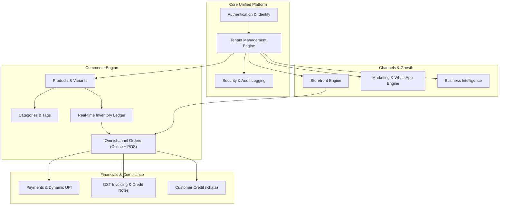
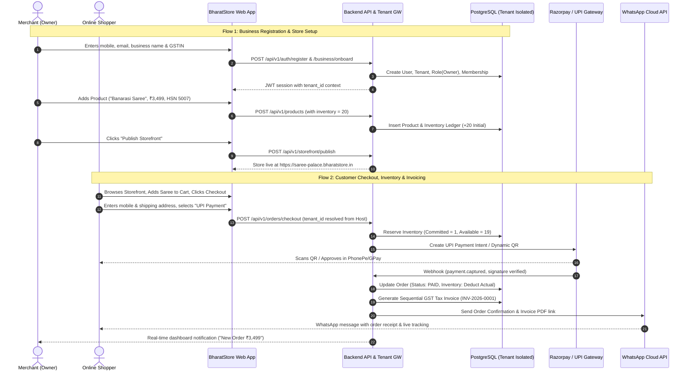
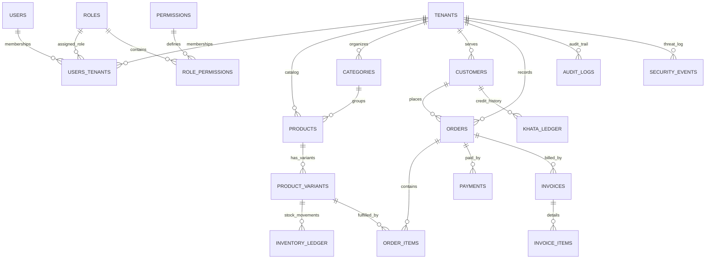

# BharatStore — Master Product & Technical Blueprint
**A Secure Unified Digital Commerce and Business Management Platform for Indian Small Businesses**

---

## 1. Product Vision & Value Proposition

### 1.1 The Indian MSME Context & Problem Statement
Small and medium-sized enterprises (MSMEs) in India—encompassing over 63 million kirana stores, regional wholesalers, local manufacturers, handicraft artisans, and emerging direct-to-consumer (D2C) brands—face acute technological fragmentation and operational drag:
- **Disjointed Point Solutions**: Merchants juggle multiple disconnected applications: Shopify (expensive USD pricing, weak native GST/UPI integration), Khatabook/Vyapar (pure offline accounting/khata without modern e-commerce storefronts), Shiprocket (logistics aggregator lacking integrated catalog engines), and WhatsApp Business (manual cataloging without automated inventory synchronization).
- **Compliance & Indian Commerce Nuances**: Existing international platforms do not natively handle Indian Goods & Services Tax (GST) structures (CGST, SGST, IGST, HSN/SAC codes, Composition Scheme vs. Regular Scheme), dynamic UPI QR generation, cash-on-delivery (COD) risk mitigation, or thermal receipt printing formats (80mm/58mm).
- **Security & Data Sovereignty**: MSME data is frequently stored in insecure architectures with weak tenant boundaries, exposing businesses to customer leakage, unauthorized employee price overrides, and unrecoverable data loss.

### 1.2 The BharatStore Solution
**BharatStore** is a purpose-built, secure, multi-tenant digital commerce and enterprise management platform designed specifically for Indian small businesses. It functions as an integrated business operating system combining:
1. **Omnichannel Storefront & POS Engine**: Instant mobile-first web storefront plus in-store counter billing (Point of Sale) sharing a unified, real-time double-entry inventory ledger.
2. **India-First Compliance & Financials**: Automated GST calculation, HSN-indexed tax invoices, delivery challans, credit notes, dynamic UPI QR generation, and B2B customer credit tracking (*Khata*).
3. **Enterprise-Grade Multi-Tenancy & Security**: Cryptographically verified tenant boundaries, granular Role-Based Access Control (RBAC), tamper-evident audit logging, and automated threat monitoring.
4. **High-Density, Accessible UI/UX**: An original "Vedic Industrial" design system engineered for maximum data density, accessibility, and fast counter throughput on both mobile screens and desktop counters.

---

## 2. User Types & Roles System (Least-Privilege RBAC)

### 2.1 User Types & Target Personas
1. **The Modern Kirana & Retailer (Sunil, 38)**: Needs rapid counter billing (< 10 seconds per customer), real-time stock deductions, low-stock alerts, and dynamic UPI QR displays for walk-in shoppers.
2. **The Wholesale Distributor (Rajesh, 49)**: Requires B2B tier pricing, bulk orders, credit limit tracking (*Khata* ledger), formal GST tax invoices with transport details, and multi-staff counter management.
3. **The Home & Handicraft Artisan (Pooja, 27)**: Needs a brandable mobile storefront, Instagram/WhatsApp catalog sharing, pre-paid Razorpay/Cashfree checkout, and automated shipping labels.
4. **The Emerging D2C Brand (Vikram, 32)**: Needs conversion analytics, discount codes, customer cohort segmentation, abandoned cart recovery via WhatsApp, and staff permission boundaries.

### 2.2 Role & Permission Matrix
The system enforces the **Principle of Least Privilege (PoLP)**. Permissions are defined as explicit strings formatted as `<domain>:<resource>:<action>` (e.g., `commerce:orders:refund`).

| System Capability | Owner | Admin | Manager | Staff (Cashier/Packer) |
| :--- | :---: | :---: | :---: | :---: |
| **Business Sovereignty** (Delete Business, Transfer Ownership) | ✅ Full | ❌ Denied | ❌ Denied | ❌ Denied |
| **Subscription & Billing Plan** | ✅ Full | ✅ Full | ❌ Denied | ❌ Denied |
| **Staff Management & Role Assignment** | ✅ Full | ✅ Full | ❌ Denied | ❌ Denied |
| **Security Center & API Keys** | ✅ Full | ✅ Full | ❌ Denied | ❌ Denied |
| **Audit Logs Inspection** | ✅ Full | ✅ Full | ❌ Denied | ❌ Denied |
| **Payment Gateway Configuration** | ✅ Full | ✅ Full | ❌ Denied | ❌ Denied |
| **GST & Tax Rate Configuration** | ✅ Full | ✅ Full | ❌ Denied | ❌ Denied |
| **Product Catalog Creation & Pricing** | ✅ Full | ✅ Full | ✅ Full | 👁️ Read Only |
| **Inventory Stock Adjustment / Write-off** | ✅ Full | ✅ Full | ✅ Full (Logged) | ❌ Denied |
| **Storefront Customization & Publishing** | ✅ Full | ✅ Full | ✅ Full | ❌ Denied |
| **Marketing Campaigns & Discounts** | ✅ Full | ✅ Full | ✅ Full | ❌ Denied |
| **Financial Analytics & Profit Margins** | ✅ Full | ✅ Full | 👁️ Limited (Sales) | ❌ Denied |
| **Create Walk-in / Online Orders** | ✅ Full | ✅ Full | ✅ Full | ✅ Full |
| **Process Order Fulfillment & Dispatch** | ✅ Full | ✅ Full | ✅ Full | ✅ Full |
| **Generate & Print Tax Invoices** | ✅ Full | ✅ Full | ✅ Full | ✅ Full (Print/View) |
| **Issue Refunds & Order Cancellations** | ✅ Full | ✅ Full | ⚠️ Limit (< ₹5,000) | ❌ Denied |
| **Export Customer Database / Financials** | ✅ Full | ✅ Full | ❌ Denied | ❌ Denied |

---

## 3. Feature Architecture & Information Architecture



### 3.1 Detailed Module Breakdown (18 Core Modules)

#### 1. Public Website & Portal
- **Purpose**: Brand presence, value proposition showcase, feature tours, pricing calculator (INR), interactive demo, developer/partner links.
- **Major Screens**: Hero Landing, Features Showcase, Pricing Calculator, Compliance FAQ, Contact & Sales.
- **Major Actions**: Start 14-day free trial, Book demo, View public documentation.
- **Dependencies**: None.

#### 2. Authentication & Identity
- **Purpose**: Secure credential verification, session lifecycle management, MFA, and OAuth2/passwordless recovery.
- **Major Screens**: Login, Sign Up, Email Verification, Forgot Password, Reset Password, MFA Challenge (TOTP / SMS OTP), Session Revocation.
- **Major Actions**: Register, Authenticate, Step-up MFA, Revoke devices.
- **Required Data**: Email, mobile number (+91), Argon2id password hash, TOTP secrets, session metadata (IP, User Agent).
- **Dependencies**: Tenant Engine, Audit Logging.

#### 3. Business Onboarding
- **Purpose**: Streamlined setup flow transforming raw credentials into a fully configured Indian business entity.
- **Major Screens**: Legal Entity Details, GSTIN Verification (auto-populates legal name & state), Storefront Subdomain Claiming, Currency & Fiscal Year Settings, Bank & UPI Details.
- **Major Actions**: Verify GSTIN via Govt API sandbox, validate store slug availability, initialize default categories.
- **Dependencies**: Auth, Tenant Engine.

#### 4. Dashboard (Mission Control)
- **Purpose**: Real-time high-density operational cockpit displaying critical KPIs, sales trends, and urgent action items.
- **Major Screens**: Executive Dashboard, Quick Action Drawer.
- **Major Actions**: Filter date ranges (Today, Yesterday, Last 7 Days, Month-to-date, Custom), trigger fast Walk-in POS Sale, jump to low-stock orders.
- **Required Data**: Gross Merchandise Value (GMV), net sales, active orders count, low-stock threshold triggers, live payment settlements.
- **Dependencies**: Orders, Inventory, Payments, Analytics.

#### 5. Products & Variants
- **Purpose**: Centralized SKU catalog management with physical variant support, Indian HSN tax mapping, and multi-channel publishing.
- **Major Screens**: Product List (data table with bulk actions), Add Product, Edit Product, Variant Matrix Generator, Bulk CSV Import/Export.
- **Major Actions**: Create SKU, upload compressed WebP product imagery, configure variant matrix (Size, Color, Material), map 4/6/8-digit HSN code, set MRP vs. Selling Price, toggle storefront visibility.
- **Required Data**: Title, slug, description, HSN code, GST slab (0%, 5%, 12%, 18%, 28%), base cost, MRP, selling price, weight, dimensions, images.
- **Dependencies**: Categories, Inventory, Media Storage.

#### 6. Categories & Collections
- **Purpose**: Hierarchical taxonomy and dynamic collection rules for storefront navigation and catalog filtering.
- **Major Screens**: Category Tree Manager, Collection Details.
- **Major Actions**: Create parent/child categories, set SEO meta tags, upload collection banners, arrange storefront display order.
- **Dependencies**: Products.

#### 7. Inventory & Stock Management
- **Purpose**: Tamper-proof, double-entry inventory ledger tracking every unit across warehouses, retail counters, and storefront allocations.
- **Major Screens**: Stock Overview, Stock Adjustments, Low Stock Alerts, Purchase Orders / Stock Inward, Batch & Expiry Tracker.
- **Major Actions**: Manual stock reconciliation, log loss/damage/theft, inward shipment intake, configure safety buffer levels.
- **Required Data**: SKU, available stock, committed/reserved stock, incoming stock, cost per unit, reorder trigger point.
- **Dependencies**: Products, Orders, Suppliers.

#### 8. Omnichannel Orders
- **Purpose**: Unified order pipeline handling online storefront purchases, manual phone orders, and walk-in counter sales.
- **Major Screens**: Orders Table (status tabs), Order Detail View, Counter POS Terminal, Shipping Label Generator.
- **Major Actions**: Accept order, mark packed, generate shipping manifest, dispatch, mark delivered, process return/exchange, cancel with reason.
- **Required Data**: Order number (e.g. `BS-2026-00104`), line items, customer details, shipping address, billing address, payment status, fulfillment status, timeline log.
- **Dependencies**: Products, Inventory, Customers, Invoicing, Payments.

#### 9. Customers & Khata Ledger
- **Purpose**: Customer 360 profile, purchase frequency metrics, delivery addresses, and Indian B2B credit ledger (*Udhaar/Khata*).
- **Major Screens**: Customer Directory, Customer Detail View (Purchase history + Credit Ledger), Outstanding Khata Aging Report.
- **Major Actions**: Add customer, record ledger payment, send payment reminder via WhatsApp, adjust credit limit, tag VIP/Wholesale.
- **Required Data**: Name, phone number (+91), email, GSTIN (for B2B), balance credit, lifetime order value, notes.
- **Dependencies**: Orders, Invoicing.

#### 10. Payments & UPI Engine
- **Purpose**: Multi-channel payment aggregation supporting Indian domestic payment rails (UPI, RuPay, Netbanking, Cards, Wallets, COD).
- **Major Screens**: Transactions Feed, Settlement Summary, Payment Gateway Config (Razorpay/Cashfree/Stripe), Dynamic UPI QR Setup.
- **Major Actions**: Verify webhook signature, generate instant UPI Intent URL / QR code, initiate partial/full refund, reconcile COD collections.
- **Required Data**: Payment ID, Gateway Reference, Payment method, Gross amount, Gateway fee, Net payout, Status (Pending, Authorized, Captured, Failed, Refunded).
- **Dependencies**: Orders, Invoicing.

#### 11. Invoices & GST Compliance
- **Purpose**: Legally compliant Indian Tax Invoices, Proforma Invoices, Delivery Challans, and Credit Notes conforming to GST rules.
- **Major Screens**: Invoice Registry, Invoice Viewer/Printer, GST Summary Report (GSTR-1 preparation data).
- **Major Actions**: Auto-generate invoice upon order confirmation, download A4 & 80mm thermal receipt PDFs, issue credit note with GST reversal, export monthly GSTR-1 CSV.
- **Required Data**: Invoice sequential number, reverse charge flag, supplier GSTIN, recipient GSTIN/state code, place of supply, HSN itemized table (CGST, SGST, IGST breakdown), digital signature stamp.
- **Dependencies**: Orders, Customers, Business Profile.

#### 12. Storefront Engine & Theme Builder
- **Purpose**: Ultra-fast, SEO-optimized, mobile-first customer storefront accessible via custom domain or `tenant.bharatstore.in`.
- **Major Screens**: Theme Customizer, Page Editor (Home, About, Policies, Contact), Live Preview, Navigation Menu Builder.
- **Major Actions**: Choose typography & brand colors, configure hero banners, feature collections, publish live theme, manage custom domains with auto-SSL.
- **Dependencies**: Products, Categories, Media Storage.

#### 13. Marketing & Customer Engagement
- **Purpose**: Drive sales velocity via targeted discount rules, promotional coupon codes, and automated WhatsApp/SMS notifications.
- **Major Screens**: Coupons Manager, Campaign Broadcasts, Abandoned Cart Pipeline.
- **Major Actions**: Create percentage/flat discount coupons, configure minimum purchase amount, trigger WhatsApp abandoned cart nudge with single-click checkout link.
- **Required Data**: Promo code, usage limits, start/end dates, recovery rate metrics.
- **Dependencies**: Orders, Customers.

#### 14. Business Analytics & Intelligence
- **Purpose**: Operational insights empowering Indian business owners to understand profitability, inventory velocity, and customer retention.
- **Major Screens**: Sales Performance, Product Velocity (Dead stock vs. Fast movers), Tax Liability, Customer Cohorts.
- **Major Actions**: Export financial reports (Excel/CSV), compare period-over-period growth, calculate net profit after COGS and shipping.
- **Dependencies**: Orders, Inventory, Products, Payments.

#### 15. Staff Management & Granular Access
- **Purpose**: Secure delegation of daily duties to managers, accountants, and floor staff without compromising company integrity.
- **Major Screens**: Staff Directory, Invite Staff Member, Role Assignment Modal, Staff Activity History.
- **Major Actions**: Send email/SMS invite link, assign predefined role or custom permissions, immediately freeze/revoke account access.
- **Required Data**: Staff profile, assigned role ID, assigned counter/location, active status.
- **Dependencies**: Auth, RBAC, Audit Logging.

#### 16. Business Settings
- **Purpose**: Core business preferences, addresses, localization, and technical configurations.
- **Major Screens**: Business Profile, Tax & GST Configuration, Shipping Zones & Flat/Calculated Rates, Receipt Customizer, Custom Domain DNS Setup.
- **Major Actions**: Update logo, toggle COD availability, define PIN-code delivery ranges, set thermal printer paper width.
- **Dependencies**: Tenant Engine.

#### 17. Security Center
- **Purpose**: Platform defense dashboard giving the business owner full visibility into access security, active devices, and API credentials.
- **Major Screens**: Security Health Score, Active Sessions List, API Keys & Webhooks Manager, IP Whitelist.
- **Major Actions**: Revoke suspicious sessions, generate scoped API keys (Read-only vs. Read-write), configure webhook endpoints with HMAC secrets.
- **Required Data**: IP address, Geolocation, Device/Browser fingerprint, Last active timestamp, Key hashes.
- **Dependencies**: Auth, Audit Logging.

#### 18. Audit Logs (Tamper-Evident)
- **Purpose**: Regulatory and forensic traceability recording every sensitive state transition across the business.
- **Major Screens**: Audit Log Feed with advanced filtering (Actor, Action, Resource, Date).
- **Major Actions**: Inspect before/after JSON diffs, export signed compliance audit trail.
- **Required Data**: Event ID, Actor ID, Actor Role, Client IP, Resource Type, Resource ID, Action, Timestamp, Before State, After State.
- **Dependencies**: All Modules.

---

## 4. Application Navigation & App Shell Layout

```
+-----------------------------------------------------------------------------------------------+
| BHARATSTORE LOGO | [Rajesh Fabrics v] | [Q Search anything... Cmd+K] | [🔔 3] | [User Avatar] |
+-----------------------------------------------------------------------------------------------+
| SIDEBAR              | BREADCRUMBS: Dashboard > Products > Add Product                        |
|                      +------------------------------------------------------------------------+
| 📊 Dashboard         | PAGE TITLE: Add New Product                [Discard]  [Save Product]   |
| 📈 Analytics         +------------------------------------------------------------------------+
|                      | MAIN CONTENT AREA                                                      |
| COMMERCE             | +------------------------------------+  +----------------------------+ |
| 📦 Products          | | Title & Description                |  | Organization               | |
| 🏷️ Categories        | | [ Silk Banarasi Saree            ] |  | Category: [ Traditional v] | |
| 🏢 Inventory         | |                                    |  | Tags: [ Festive x ]        | |
| 🛒 Orders (12)       | +------------------------------------+  +----------------------------+ |
|                      | | Pricing & GST Compliance           |  | Media                      | |
| FINANCE              | | MRP: [ ₹ 4,999 ] Selling: [₹3,499] |  | [ + Drag & Drop Images   ] | |
| 💳 Payments          | | HSN: [ 5007 ] GST Slab: [ 5% v ]   |  |                            | |
| 📄 Invoices          | +------------------------------------+  +----------------------------+ |
| 👥 Khata Ledger      | | Variants                           |  | Inventory                  | |
|                      | | Color: [ Red, Green, Gold ]        |  | SKU: [ BAN-SILK-01       ] | |
| STOREFRONT           | +------------------------------------+  | Stock: [ 45              ] | |
| 🎨 Theme Builder     |                                         +----------------------------+ |
| 🌐 Custom Domains    |                                                                        |
|                      |                                                                        |
| ADMINISTRATION       |                                                                        |
| 👥 Staff & Roles     |                                                                        |
| 🔒 Security Center   |                                                                        |
| 📜 Audit Logs        |                                                                        |
| ⚙️ Settings          |                                                                        |
+-----------------------------------------------------------------------------------------------+
| MOBILE: Bottom Navigation Bar [Home] [Orders] [POS Counter] [Products] [More...]              |
+-----------------------------------------------------------------------------------------------+
```

### 4.1 Navigation Elements
- **Header Bar**: Displays global search (`Cmd+K` / `Ctrl+K`), real-time notification drawer, active business switcher dropdown, and user profile avatar menu.
- **Sidebar**: Sticky left navigation organized into logical sections:
  - *Core*: Dashboard, Analytics
  - *Commerce*: Products, Categories, Inventory, Orders, POS Counter
  - *Finance*: Payments, Invoices, Customer Khata
  - *Storefront*: Storefront Builder, Custom Domains
  - *Administration*: Staff Management, Security Center, Audit Logs, Settings
- **Breadcrumb Trail**: Standardized hierarchical path (`Home > Commerce > Products > Edit Product`) rendered at the top of every inner screen.
- **Action Toolbar**: Top-right placement for primary page operations ("Save", "Export", "Create Order").
- **Mobile Navigation**: Bottom tab bar for key high-frequency actions (`Home`, `Orders`, `POS Counter`, `Stock`, `Menu`).

---

## 5. UI/UX Design System ("Vedic Industrial")

BharatStore features an original aesthetic: **"Vedic Industrial"**—a fusion of clean Scandinavian functionalism (Linear/Stripe clarity) with Indian warmth, precision typography, and micro-borders. It avoids noisy gradients and gimmicky glassmorphism in favor of sharp structural borders, purposeful contrast, and high tabular data density.

### 5.1 Design Tokens Specification

```css
:root {
  /* Brand Palettes: Saffron Amber & Deep Slate */
  --brand-50:  #fffbeb;
  --brand-100: #fef3c7;
  --brand-500: #f59e0b; /* Bharat Amber / Saffron Accent */
  --brand-600: #d97706;
  --brand-700: #b45309;

  /* Primary Surfaces: Deep Kashi Slate / Obsidian */
  --primary-900: #0f172a; /* Main text & brand anchor */
  --primary-800: #1e293b;
  --primary-700: #334155;

  /* Neutral Backgrounds & Surfaces (Light Mode Standard) */
  --bg-canvas:   #f8fafc; /* Crisp off-white app background */
  --bg-surface:  #ffffff; /* Card and table surface */
  --bg-subtle:   #f1f5f9; /* Table headers, input backdrops */
  --bg-hover:    #e2e8f0;

  /* Semantic Borders */
  --border-subtle:  #e2e8f0;
  --border-default: #cbd5e1;
  --border-focus:   #0f172a;

  /* Status Tokens */
  --success-bg:   #ecfdf5; --success-border: #a7f3d0; --success-text: #065f46;
  --warning-bg:   #fffbeb; --warning-border: #fde68a; --warning-text: #92400e;
  --error-bg:     #fef2f2; --error-border:   #fecaca; --error-text:   #991b1b;
  --info-bg:      #eff6ff; --info-border:    #bfdbfe; --info-text:    #1e40af;

  /* Typography */
  --font-sans:    'Plus Jakarta Sans', 'Inter', -apple-system, sans-serif;
  --font-mono:    'JetBrains Mono', monospace;
  
  /* Scale */
  --text-2xs: 10px; /* Badges & indicators */
  --text-xs:  12px; /* Secondary labels & timestamps */
  --text-sm:  14px; /* Standard body text & table cells */
  --text-base:16px; /* Primary inputs & card titles */
  --text-lg:  18px; /* Section headers */
  --text-xl:  20px; /* Modal headers */
  --text-2xl: 24px; /* Page titles */
  --text-3xl: 30px; /* Metric highlights */

  /* Spacing (4px baseline grid) */
  --space-1: 4px;   --space-2: 8px;   --space-3: 12px;
  --space-4: 16px;  --space-5: 20px;  --space-6: 24px;
  --space-8: 32px;  --space-10: 40px; --space-12: 48px;

  /* Radii */
  --radius-xs: 4px;  /* Small badges, pills */
  --radius-sm: 6px;  /* Form inputs, buttons */
  --radius-md: 8px;  /* Cards, tables, dropdowns */
  --radius-lg: 12px; /* Modals, drawers, popovers */
  --radius-full: 9999px;

  /* Shadows: Layered, crisp, non-muddy */
  --shadow-xs: 0 1px 2px 0 rgba(15, 23, 42, 0.05);
  --shadow-sm: 0 1px 3px 0 rgba(15, 23, 42, 0.1), 0 1px 2px -1px rgba(15, 23, 42, 0.1);
  --shadow-md: 0 4px 6px -1px rgba(15, 23, 42, 0.08), 0 2px 4px -2px rgba(15, 23, 42, 0.08);
  --shadow-lg: 0 10px 15px -3px rgba(15, 23, 42, 0.08), 0 4px 6px -4px rgba(15, 23, 42, 0.04);
}
```

### 5.2 Component & System Guidelines
- **Data Tables**: Fixed 44px row heights, sticky headers with subtle grey background, left-aligned alphanumeric columns, right-aligned currency columns with `font-variant-numeric: tabular-nums`, hover highlighting, and contextual floating action bar upon multi-row selection.
- **Forms & Inputs**: High-contrast labels, integrated prefixes (`+91` flag for phones, `₹` glyph for currency), clear helper text, inline asynchronous validation feedback, and distinct red outline with assistive text on error.
- **Buttons**:
  - *Primary*: Deep slate background (`#0f172a`), white text, subtle hover lift, loading spinner integration without button resize.
  - *Secondary*: Surface white, 1px border (`#cbd5e1`), dark slate text.
  - *Accent*: Warm amber (`#d97706`) for key conversion actions ("Publish Store", "Charge Payment").
  - *Destructive*: Deep crimson text/border with light red hover fill.
- **Empty States**: Minimalist line-art illustration, clear title explaining what belongs here, single sentence actionable prompt, and one primary CTA button.
- **Loading States**: Shimmer skeleton cards and inline spinners replacing button text without structural jump.

---

## 6. Screen Architecture (27 Core Screens)

1. **Landing Page**: Public hero showcase with live interactive product demo card; value proposition for Kiranas, Wholesalers, and D2C brands; GST & UPI compliance spotlight; interactive pricing calculator; mobile-responsive single-column layout.
2. **Sign Up**: Split-screen with merchant testimonial; Full Name, Email, Mobile (+91 with SMS OTP verification trigger), Argon2-evaluated password strength meter.
3. **Login**: Centered card; Email/Mobile login with password or magic-link fallback; rate-limited brute-force lockout banner with countdown.
4. **Forgot / Reset Password**: Secure tokenized reset dispatch; blind success banner preventing account enumeration.
5. **Business Onboarding**: 4-step progressive wizard (Business Identity & GSTIN auto-fetch, Subdomain claim, Location & State tax rules, Bank/UPI settlement details).
6. **Dashboard**: High-density operational cockpit; Today's Revenue (₹), Total Orders, AOV, Pending Shipments, Low-stock alerts, Quick Walk-in POS Sale action.
7. **Products List**: Data table with bulk action bar; Stock status badges, Category filters, MRP vs. Selling Price, instant visibility toggle.
8. **Add Product**: 2-column form (Core details, HSN code selector, GST Slab dropdown, Variant matrix generator, Drag-and-drop WebP imagery).
9. **Edit Product**: Catalog modifier with audit change snippet, live storefront link, and deletion modal with safety confirmation.
10. **Categories**: Tree-view hierarchy manager with drag-and-drop nesting, banner image uploads, and storefront menu placement toggles.
11. **Inventory Overview**: Real-time stock overview with low-stock warnings, cost valuation, and inline quick-stock adjustment.
12. **Inventory Details & Stock History**: Double-entry immutable ledger tracking every unit across Inward, Sale, Return, Damage, and Staff Adjustments.
13. **Orders List**: Tabbed status workflow (All, Unfulfilled, Unpaid, Ready for Dispatch, In Transit, Delivered, Cancelled); GSTR-1 compliant sales export.
14. **Order Details**: 3-column operational layout: itemized product lines, status progression stepper, customer address, payment details, and instant invoice generation.
15. **Customer Directory**: Customer 360 table with segmentation chips (All, B2B Wholesale, Repeat Buyers, Outstanding Khata).
16. **Customer Details & Khata Ledger**: Customer profile with dual-entry credit/debit Khata ledger and single-click WhatsApp payment reminder with UPI link.
17. **Payments & Settlements**: Financial dashboard showing real-time gateway collections, next bank settlement ETA, and refund manager.
18. **Invoices Registry**: Searchable repository of compliant Tax Invoices, Delivery Challans, and Credit Notes; A4 and 80mm thermal receipt printer support.
19. **Storefront Builder**: Interactive theme editor with live responsive preview, brand color picker, and hero carousel configurator.
20. **Storefront Live Preview & Customer Experience**: Mobile-first customer experience featuring instant search, one-page checkout, OTP login, and dynamic UPI QR payment.
21. **Marketing & Engagement**: Coupon code manager, WhatsApp promotional broadcasts, and automated abandoned cart recovery pipeline.
22. **Analytics & Reports**: Revenue trends, Dead-stock vs. Fast-movers, Payment method breakdown, and State-wise tax liability map (CGST/SGST/IGST).
23. **Staff Management**: Team directory with role badges, email/SMS invite modal, and immediate session termination.
24. **Roles & Permissions**: Granular capability checklist editor adhering to least-privilege principles.
25. **Business Settings**: Tabbed configuration for Legal Details, GST Composition vs. Regular toggle, Shipping PIN-code rules, and Custom Domain DNS status.
26. **Security Center**: Security health score, active session inspector with device/IP info, API key management, and IP whitelisting.
27. **Audit Logs Explorer**: Append-only forensic activity log with deep filters, actor tracking, and before/after JSON diff inspector.

---

## 7. End-to-End User Workflows



---

## 8. Technical Architecture & Technology Stack Rationale

- **Frontend**: **Next.js 15 (App Router, React 19, TypeScript)**. Provides SSR for lightning-fast, SEO-indexed customer storefronts, alongside client-rendered SPA ergonomics for the high-density merchant management dashboard.
- **Styling**: **Tailwind CSS v4 + Radix UI Primitives**. Zero runtime CSS overhead, full design token customization, and accessible headless components.
- **Backend**: **Fastify / Node.js (TypeScript)** (or Next.js Modular Route Handlers with Service Layer). Exceptional throughput (>4x higher than standard Express), built-in JSON schema serialization, and lightweight memory footprint on affordable cloud instances.
- **Database**: **PostgreSQL 16+**. Enterprise ACID guarantees for financial transactions and inventory reservations, native JSONB support for variant matrices, and native Row-Level Security (RLS) for defense-in-depth tenant isolation.
- **Data Access & ORM**: **Prisma ORM (or Drizzle)**. End-to-end type safety, automated migrations, and client-level query extensions enforcing ambient `tenant_id` scoping.
- **Caching & Job Queue**: **Redis 7+ & BullMQ**. Microsecond tenant domain resolution, sliding-window rate limiting, asynchronous GST invoice PDF generation, and WhatsApp message queuing.
- **Object Storage**: **S3-compatible Storage (Cloudflare R2 or MinIO)**. Secure presigned upload URLs with zero egress fees for product image delivery.
- **Payment Rails**: **Razorpay & Cashfree SDKs + Dynamic UPI QR**. Complete coverage of Indian payment methods (UPI, RuPay, Netbanking, Wallets, COD).
- **Communications**: **WhatsApp Cloud API & Resend**. High open rates for Indian customer notifications (receipts, delivery tracking, abandoned cart recovery).

---

## 9. Multi-Tenant Architecture & Data Isolation

```mermaid
graph TD
    REQ["Incoming HTTP Request"] --> WAF["Cloud WAF / Reverse Proxy"]
    WAF --> GATE["API Gateway & Tenant Resolution Middleware"]
    
    GATE --> |1. Extract Domain/Header| T_RESOLV{"Resolution Strategy"}
    T_RESOLV --> |Custom Domain| DB_LOOKUP["Lookup Domain Map (Redis Cached)"]
    T_RESOLV --> |Subdomain *.bharatstore.in| SUB_LOOKUP["Extract Subdomain (Redis Cached)"]
    T_RESOLV --> |Auth JWT (Admin Dashboard)| JWT_EXTRACT["Extract tenant_id & Verify Membership"]
    
    DB_LOOKUP --> CTX["Hydrate Async Tenant Context (tenant_id)"]
    SUB_LOOKUP --> CTX
    JWT_EXTRACT --> CTX
    
    CTX --> AUTH_CHECK{"RBAC Authorization Middleware"}
    AUTH_CHECK --> |Denied| HTTP_403["403 Forbidden"]
    AUTH_CHECK --> |Allowed| SERVICE["Domain Service Layer"]
    
    SERVICE --> ORM["Prisma / Drizzle ORM Scoped Client"]
    ORM --> |Injects WHERE tenant_id = ctx.tenant_id| SQL["PostgreSQL Execution"]
    SQL --> RLS["PostgreSQL Row-Level Security (RLS) Policy"]
    RLS --> DATA[("Isolated Tenant Data")]
```

### 9.1 Tenant Resolution Strategies
1. **Storefront Public Traffic**:
   - Resolved via the incoming `Host` header.
   - Example A: `rajesh-fabrics.bharatstore.in` -> Subdomain lookup matches `tenant.slug = 'rajesh-fabrics'`.
   - Example B: `www.rajeshfabrics.com` -> Custom domain lookup matches `tenant_domain.domain = 'www.rajeshfabrics.com'`.
   - Resolution is cached in Redis with a 24-hour TTL and invalidation triggers on domain update.
2. **Admin Dashboard Traffic**:
   - Resolved via the verified cryptographic session token.
   - Contains: `sub` (User ID), `tid` (Active Tenant ID), and `roles` (Tenant Roles).
   - Switching business verifies tenant membership and mints an updated session context.

### 9.2 Tri-Layer Tenant Isolation Model
BharatStore utilizes a **Shared Database, Isolated Rows with Tri-Layer Defense**:
1. **Layer 1: Type-Safe Scoped Service Layer**:
   - All backend repositories require `tenantId: string` as the first argument. Developers cannot call database operations without providing the ambient tenant context.
2. **Layer 2: ORM Automatic Query Interceptor**:
   - Every `findMany`, `findOne`, `create`, `update`, `delete` automatically injects `tenant_id: ctx.tenantId`.
   - Any query omitting the tenant filter fails compilation and throws a runtime invariant error.
3. **Layer 3: PostgreSQL Native Row Level Security (RLS) as Defense-in-Depth**:
   - Tables contain `tenant_id UUID NOT NULL REFERENCES tenants(id) ON DELETE RESTRICT`.
   - RLS Policy Example:
     ```sql
     ALTER TABLE products ENABLE ROW LEVEL SECURITY;
     CREATE POLICY tenant_isolation_policy ON products
       AS RESTRICTIVE
       USING (tenant_id = current_setting('app.current_tenant_id', true)::uuid);
     ```
   - Before executing queries within a connection pool checkout, the database connection executes:
     `SET LOCAL app.current_tenant_id = '<resolved_tenant_id>';`

---

## 10. Database Entity Model & Relational Schema



Every tenant-owned table contains a mandatory `tenant_id UUID NOT NULL REFERENCES tenants(id)` foreign key with composite indexes on `(tenant_id, created_at)` or `(tenant_id, id)`.

---

## 11. Preliminary REST API Specification

Structured JSON response envelope:
```json
{
  "success": true,
  "data": { ... },
  "error": null,
  "meta": { "timestamp": "2026-09-06T11:45:00Z", "tenant_id": "..." }
}
```

Key Endpoint Groups:
- **`auth`**: `/register`, `/login`, `/refresh`, `/logout`, `/mfa/verify`, `/password/forgot`, `/password/reset`
- **`business`**: `/onboard`, `/profile` (GET/PATCH), `/domains` (GET/POST/DELETE)
- **`products`**: `GET /products`, `POST /products`, `GET /products/:id`, `PUT /products/:id`, `DELETE /products/:id`
- **`inventory`**: `GET /inventory`, `POST /inventory/adjust`, `GET /inventory/history/:variantId`
- **`orders`**: `GET /orders`, `POST /orders` (POS Counter), `GET /orders/:id`, `PATCH /orders/:id/status`, `POST /orders/:id/cancel`
- **`customers`**: `GET /customers`, `POST /customers`, `GET /customers/:id/khata`, `POST /customers/:id/khata`
- **`payments`**: `POST /payments/intent`, `POST /payments/webhook`, `POST /payments/refund`
- **`invoices`**: `GET /invoices`, `GET /invoices/:id/pdf`, `GET /invoices/gstr1`
- **`storefront`**: `GET /public/storefront`, `POST /public/checkout`, `GET /public/orders/:id/track`
- **`staff`**: `GET /staff`, `POST /staff/invite`, `DELETE /staff/:id`
- **`security`**: `GET /security/sessions`, `DELETE /security/sessions/:id`, `GET /audit-logs`

---

## 12. Security Architecture & Threat Defense

1. **Password Hashing**: **Argon2id** (Memory: 64MB, Iterations: 3, Parallelism: 4) with zxcvbn strength scoring.
2. **Session Security**: Short-lived Access Token (JWT, 15m) + Rotating Refresh Token stored in **HTTP-only, Secure, SameSite=Strict** cookies with token reuse detection.
3. **API Rate Limiting**: Redis-backed token bucket (Public Auth: 5/15m; Storefront: 120/min; Tenant API: 600/min).
4. **Input Validation**: Strict Zod schemas with `.strip()` discarding undeclared attributes. Rich text sanitized with DOMPurify.
5. **Auditing**: Tamper-evident append-only `audit_logs` table protected by DB-level update/delete block triggers.
6. **Backup & Recovery**: Daily encrypted pg_dump to off-site object storage + continuous WAL archiving (RPO < 15m, RTO < 1h).

---

## 13. Repository Structure

```
bharatstore/
├── apps/
│   ├── web/                           # Next.js 15 App (Admin Dashboard & Storefront)
│   │   ├── app/
│   │   │   ├── (auth)/                # Login, Register, Forgot Password
│   │   │   ├── (dashboard)/           # Protected Management App (Products, Orders, POS, Settings)
│   │   │   └── (storefront)/          # Public Customer Storefront ([tenant_slug])
│   │   ├── components/                # UI Design System (Button, Input, Table, Modal)
│   │   └── lib/                       # Hooks, TanStack clients, formatters
│   └── api-server/                    # Fastify / Node.js High-Throughput REST Core
│       └── src/modules/               # Domain vertical slices (auth, products, inventory, orders, invoices)
├── packages/
│   ├── database/                      # Prisma Schema, Migrations, Seeds, RLS wrappers
│   ├── shared/                        # TypeScript Types, Zod Schemas, GST Constants, Utilities
│   └── config/                        # Shared ESLint, Tailwind, TS Configs
├── docs/                              # Architecture Blueprint, API Specs, Compliance Guides
├── docker/                            # Docker Compose (Postgres 16, Redis 7, MinIO)
└── package.json                       # Turborepo / npm workspaces root
```

---

## 14. Phased Development Roadmap (Vertical Slices)

- **Milestone 1**: Foundations, Auth, Multi-Tenancy Shell & Design System Tokens.
- **Milestone 2**: Product Catalog, Variants, HSN Tax Mapping & Double-Entry Inventory Ledger.
- **Milestone 3**: Omnichannel Orders, Customer Directory & Counter POS Terminal.
- **Milestone 4**: Payments Engine (UPI QR, Razorpay) & GST Invoicing Engine (A4 & Thermal).
- **Milestone 5**: Dynamic Public Storefront, Cart, Checkout & WhatsApp Order Notifications.
- **Milestone 6**: Staff Management, Granular RBAC, Audit Logs & Security Center.
- **Milestone 7**: Analytics Dashboard, Marketing Engine, GSTR-1 Export & Production Hardening.

---

## 15. Key Technical Risks & Mitigation Strategies

- **Flash Sale Concurrency**: Atomic SQL stock decrement (`UPDATE inventory SET available = available - 1 WHERE available >= 1`) within ACID transactions.
- **Payment Webhook Idempotency**: Unique constraint on `gateway_event_id` in `payment_events` table; duplicate webhooks are safely ignored.
- **Cross-Tenant Leakage**: Tri-layer defense (Scoped service layer + ORM automatic query filter + PostgreSQL RLS).
- **Indian GST Edge Cases**: Automated classification of Intra-state (CGST + SGST) vs. Inter-state (IGST) using 2-digit state codes; Composition Scheme locked to zero tax with "Bill of Supply" titling.
